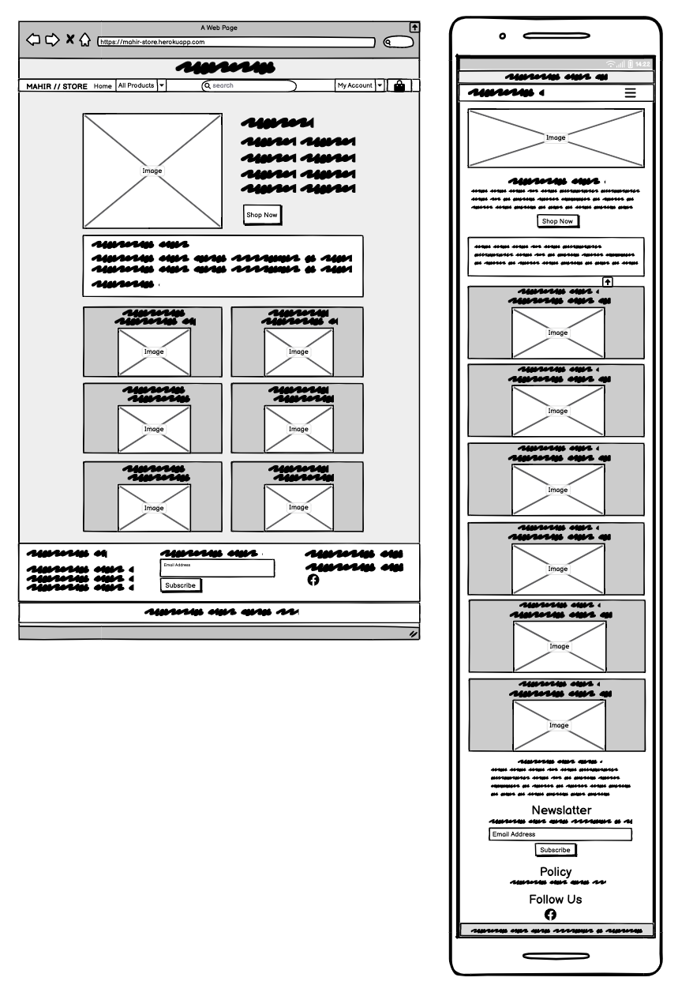
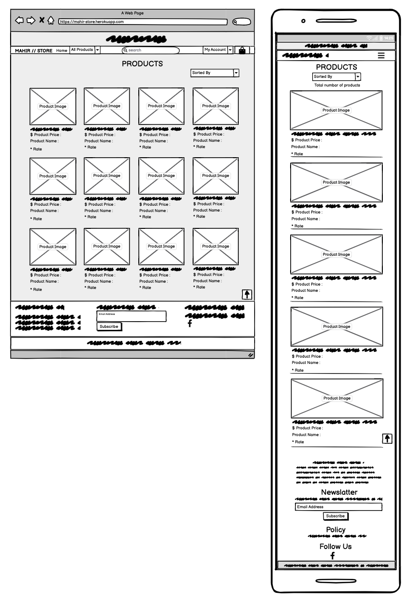
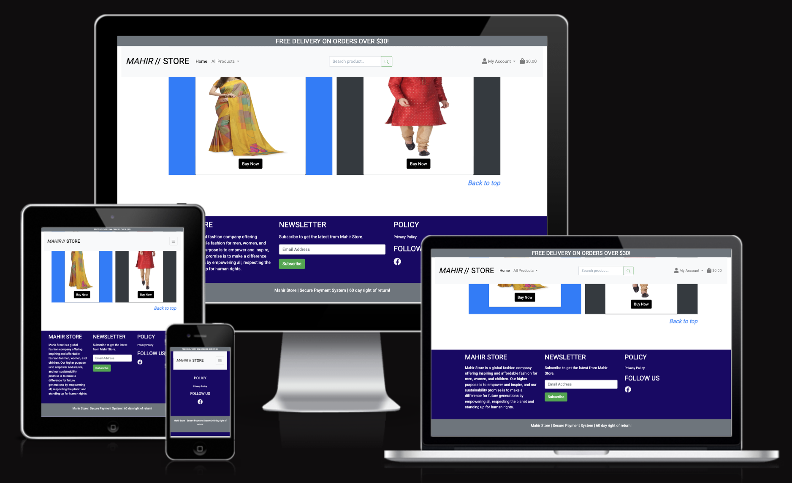
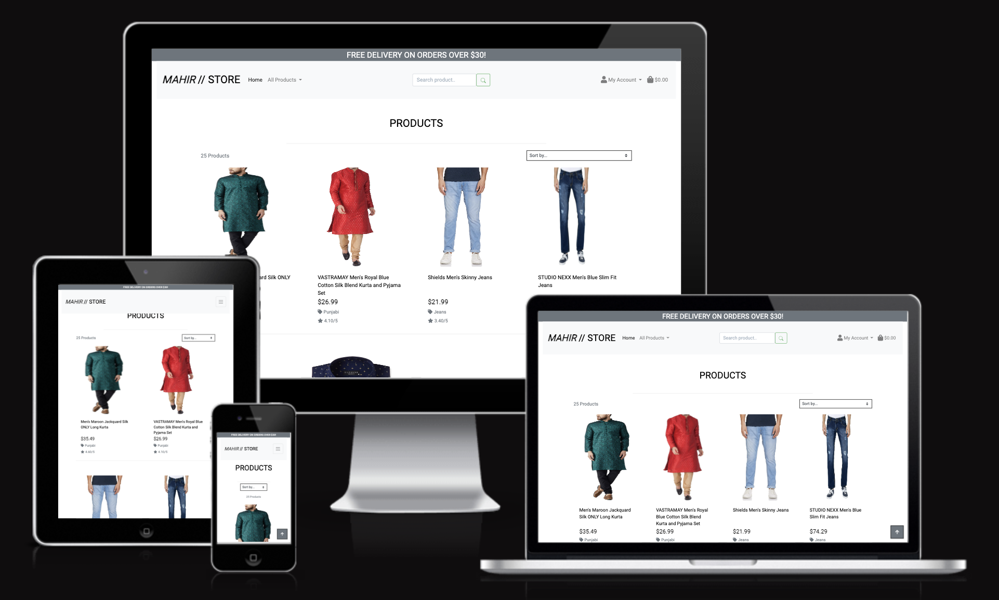
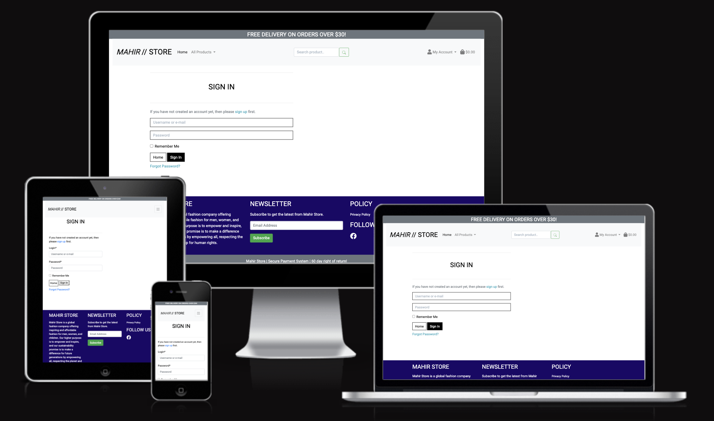
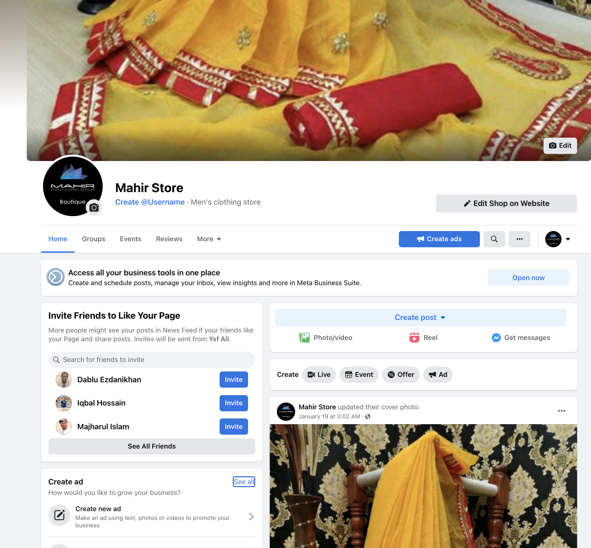
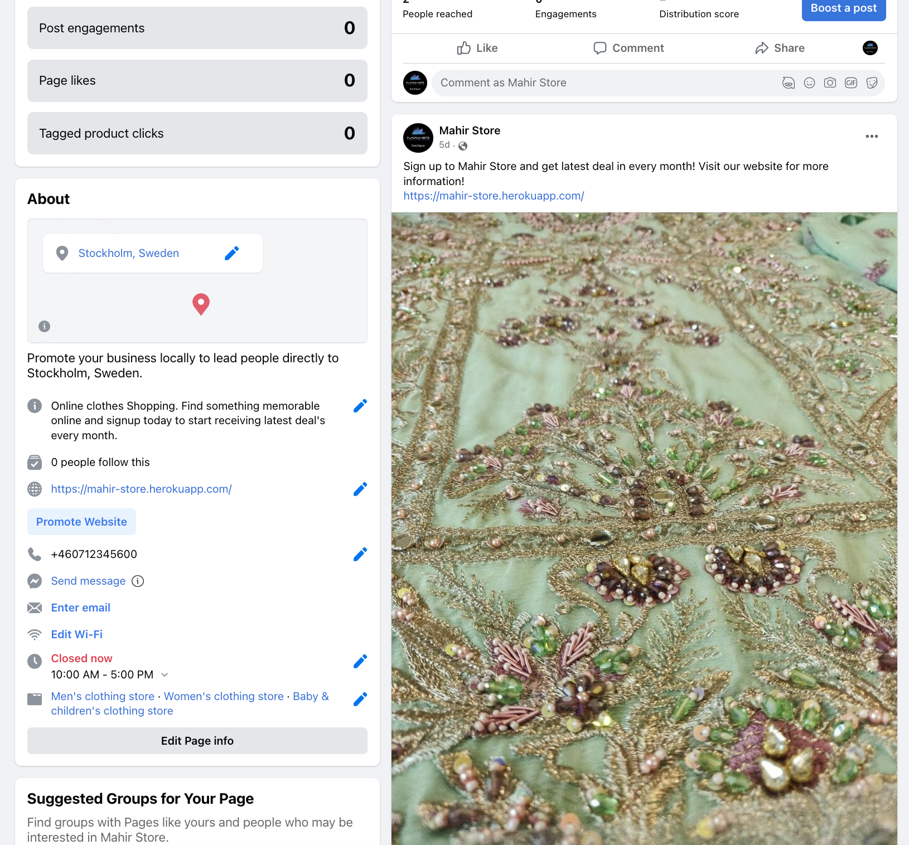
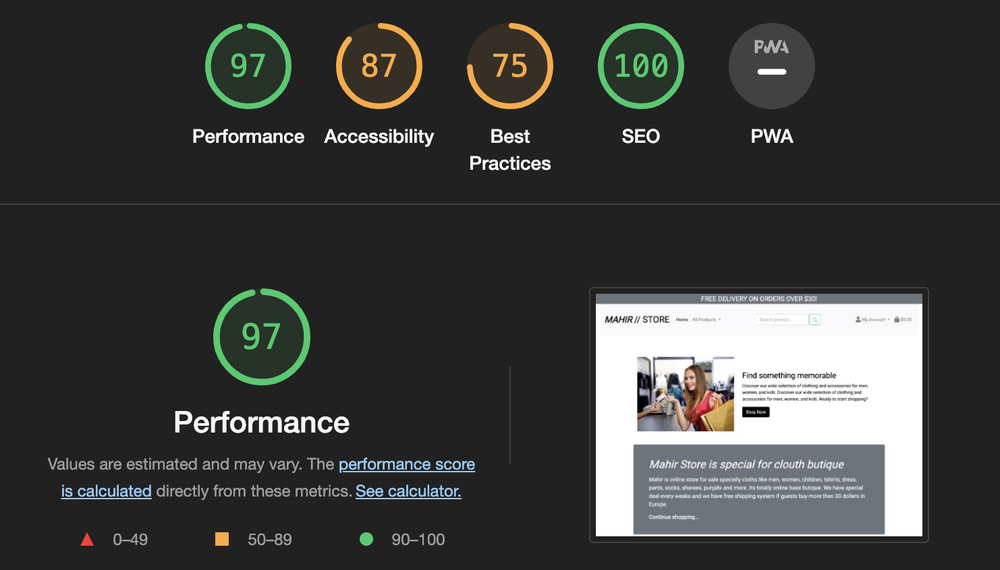

- [Contents](#contents)
- [Mahir Store](#mahir-store)
  * [UX](#ux)
  * [Purpose](#purpose)
  * [User Stories](#user-stories)
    + [User Stories for in this project](#user-stories-for-in-this-project)
  * [Wireframes](#wireframes)
    + [Home page](#home-page)
    + [All Products](#all-products)
    + [Product details](#product-details)
    + [Profile app](#profile-app)
  * [Agile Methodology](#agile-methodology)
    + [Canban board](#canban-board)
  * [Existing Features](#existing-features)
    + [Navbar](#navbar)
    + [Footer](#footer)
    + [Shop](#shop)
    + [User authentication](#user-authentication)
    + [Javascript validation on input](#javascript-validation-on-input)
    + [Success page after question is submitted](#success-page-after-question-is-submitted)
    + [search option in questions](#search-option-in-questions)
  * [Search Engine Optimalization](#search-engine-optimalization)
  * [Web Marketing](#web-marketing)
    + [Newsletter](#newsletter)
    + [Facebook](#facebook)
  * [Technologies Used](#technologies-used)
    + [Languages Used](#languages-used)
    + [Technologies and Programs Used:](#technologies-and-programs-used-)
    + [Frameworks Libraries and Programs Used](#frameworks-libraries-and-programs-used)
  * [Code Validation](#code-validation)
    + [HTML beautify](#html-beautify)
    + [HTML valiation](#html-valiation)
    + [CSS validation](#css-validation)
    + [JavaScript validation](#javascript-validation)
    + [Python beautify](#python-beautify)
    + [Python validator](#python-validator)
  * [Tests](#tests)
    + [Lighthouse](#lighthouse)
  * [Deployment and making a clone](#deployment-and-making-a-clone)
    + [Deployment to heroku](#deployment-to-heroku)
    + [Setting up your local enviroment](#setting-up-your-local-enviroment)
    + [Getting Stripe keys](#getting-stripe-keys)
    + [Getting email variables from gmail](#getting-email-variables-from-gmail)
    + [Setting AWS bucket](#setting-aws-bucket)
  * [Credits](#credits)
    + [Online resources](#online-resources)
    + [Tutorials and inspiration](#tutorials-and-inspiration)
    + [People](#people)


# Mahir Store

[](https://mahir-store.herokuapp.com/)

Click [here](https://mahir-store.herokuapp.com/) to live site.  
------

## UX

Mahir Store is designed in e-commerce based. Color background and light cards are used. The user is given different kind of choices which way to get to the shop from the home page. 

To make a purchase user can pay with a credit card as checkout page features stripe payments.

The user can also sign up and subscribe to the newsletter via email.

## Purpose

The app is designed as a e-commerce application that encourages the users to make a purchase

## User Stories

### User Stories for in this project

| id  |  content |
| ------ | ------ |
|  [#1](https://github.com/mamuzaan/portfolio_p5_store/issues/1) | As a Shopper I want to be able to View a list of products So that Select some to purchase |
|  [#2](https://github.com/mamuzaan/portfolio_p5_store/issues/2) | As a shopper I want to be able to view individual product details So that identify the price description, product rating, product image and available sizes |
|  [#3](https://github.com/mamuzaan/portfolio_p5_store/issues/3) | As a Shopper I want to be able to quickly identify deals clearance, items and special offers So that take advantage of special savings on products I'd like to purchase |
|  [#4](https://github.com/mamuzaan/portfolio_p5_store/issues/4) | As a shopper I want to be able to easily see what I've searched for and the number of results so that quickly decide whether the product I want is available |
|  [#5](https://github.com/mamuzaan/portfolio_p5_store/issues/5) | As a shopper I want to be able to sort the list of available products so that I can easily identify the best rated, best priced and category based sorted products |
|  [#6](https://github.com/mamuzaan/portfolio_p5_store/issues/6) | As a shopper I want to be able to search for a product by name or description so that I can find a specific product I'd like to purchase |
|  [#7](https://github.com/mamuzaan/portfolio_p5_store/issues/7) | As a shopper I want to be able to sort a specific category of product so that I can find the best priced or best rated product in a specific category or sort the products in that category by name |
|  [#8](https://github.com/mamuzaan/portfolio_p5_store/issues/8) | As a shopper I want to be able to view items in my bag to be purchased so that I can identify the total cost of my purchase and all items I will receive |
|  [#9](https://github.com/mamuzaan/portfolio_p5_store/issues/9) | As a shopper I want to be able to adjust the quantity of individual items in my bag so that I can easily make changes to my purchase before checkout |
|  [#10](https://github.com/mamuzaan/portfolio_p5_store/issues/10) | As a shopper I want to be able to view an order confirmation after checkout so that I can verify that I haven't made any mistakes |
|  [#11](https://github.com/mamuzaan/portfolio_p5_store/issues/11) | As a shopper I want to be able to easily enter my payment so that I can checkout quickly and with no hassies |
|  [#12](https://github.com/mamuzaan/portfolio_p5_store/issues/12) | As a shopper I want to be able to feel my personal and payment information is safe and secure so that I can confidently provid the needed information to make a purchase |
|  [#13](https://github.com/mamuzaan/portfolio_p5_store/issues/13) | As a shopper I want to be able to receive an email confirmation after checking out so that I can keep the confirmation of what I have purchased for my records |
|  [#14](https://github.com/mamuzaan/portfolio_p5_store/issues/14) | As a site user I want to be able to have a personalized user profile so that I can view my personal order history and order confirmations, and save my payment information |
|  [#15](https://github.com/mamuzaan/portfolio_p5_store/issues/15) | As a shopper I want to be able to easily view the total of my purchases at any time So that avoid spending too much |
|  [#16](https://github.com/mamuzaan/portfolio_p5_store/issues/16) | As a shopper I want to be able to easily select the size and quantity of a product when purchasing it so that ensure I don't accidentally select the wrong product quantity or size |
|  [#17](https://github.com/mamuzaan/portfolio_p5_store/issues/17) | As a shopper I want to be able to sort multiple categories of products simultaneously so that I can find the best priced or best rated products across board categories such as 'shirt' or 'pants' |
|  [#18](https://github.com/mamuzaan/portfolio_p5_store/issues/18) | As a site user I want to be able to easily register for an account so that have a personal account and be able to view my profile |
|  [#19](https://github.com/mamuzaan/portfolio_p5_store/issues/19) | As a site user I want to be able to easily login or logout so that I can access my personal account information |
|  [#20](https://github.com/mamuzaan/portfolio_p5_store/issues/20) | As a site user I want to be able to easily recover my password in case I forget it so that I can recover access to my account |
|  [#21](https://github.com/mamuzaan/portfolio_p5_store/issues/21) | As a site user I want to be able to receive an email confirmation after registering so that I can verify my account registration was successful |
|  [#22](https://github.com/mamuzaan/portfolio_p5_store/issues/22) | As a Store owner I want to be able to add a product so that I can add new items to my store |
|  [#23](https://github.com/mamuzaan/portfolio_p5_store/issues/23) | As a Store owner I want to be able to Edit Update a product so that I can change product prices, descriptions, images and other product criteria |
|  [#24](https://github.com/mamuzaan/portfolio_p5_store/issues/24) | As a Store owner I want to be able to delete a product so that I can remove items that are no longer for sale |

## Wireframes 

The general structure of the page on this project and many of it's features. Wireframes were created with [Balsamiq](https://balsamiq.com/wireframes/?gclid=Cj0KCQiAubmPBhCyARIsAJWNpiMYzrk_0rLzl3vgYKRLXwnX7rpqyQiUFdyt3xHGpRiHlZlozwO_pvcaAvUFEALw_wcB). 

### Home page



The design of this page is heavily inspired by bootstrap example. This design was than further individualised to match the overal style of the page.

Home page is divided into two main sections: carousele and product images. This aims to give the user a feeling of dealing with real people.

### All Products



The design of this page is products of all categories. This design was than further individualised to match the overal style of the page.

This page is divided for all type of product images.

### Product details


The design of this page is products for details of this product. This page is divided for details of product like images, size, price, category, desctiption and more.

### Profile app


The design of this page is user profile. This page is divided for details of Users name, address, state, county, postcode, country and history of products already user shop.

## Agile Methodology

### Canban board


Github issues were used to create the User stories and group. Link to the project with live issues can be found [here](https://github.com/users/mamuzaan/projects/5).

## Existing Features

### Navbar


A wide navbar with large icons has been designed for desktop users and narrow simple navbar for mobile phone users. Each navbar appears and disapears according to bootstrap classes. 

### Footer



Footer is kept very simple as set of links and a little text. Subscribe with email form is present there and social business page is active.

### Shop



Currently shop features is present. Future development might see adding mahir store tools added. User can add. product to shopping bag and buy from shopping bag. 

User can shop with credit card. Stripe secure payment system is active there.

### User authentication



All allauth templates were styled to match the colours and feel of the page. 

### Javascript validation on input

Another important feature that had to be dropped due to short deadline is javascript validation on input. User currently is notified by django messages in the form of toasts that something went wrong with the form. Idealy we should have javascript preventing submittion and checking if the form is correct on user input. This would give user instant feedback and chance to correct the form. 

### Success page after question is submitted

It would be a good idea to add a success page after the question is submitted. This page could contain the Subscriber form to encourage user to subscribe

### Dashboard for superuser

Currently all special pages dedicated for superuser are located in navbar under a user icon. This is higly impractical and should be changed. The superuser should have a admin panel. This would feature all links that require special permittions.

### search option in questions

It would be a great help if the user has been welcomed with a search form on FAQ page. This would let user search the library of our questions to see if someone has asked about the issue he is having. 

This would also limit repeating the same questions by other users. 

## Search Engine Optimalization

SEO techniques were implemented to the best of my ability. I used keywords: T-shirt, dress, punjabi, sharee, socks, pants, jeans, children, Image alternative text is descriptive.

The site has been equipped with sitemap generated [here](https://www.xml-sitemaps.com/) and robots.txt. 

The site also has privacy policy and terms of service - both documents generated [here](https://policymaker.io/)

## Web Marketing

### Newsletter

I've opted for creating a custom Newsletter model to use Mailchimp. The Page owner can send regular interesting content containing advice on Mahir Store to the subscribers. 

### Facebook

Mahir Store's utilises [facebook](https://www.facebook.com/Mahir-Store-100943332909290) for marketing purposes to post adverts, interesting content and get users engaged. 




## Technologies Used

### Languages Used

   + HTML5
   + CSS3
   + JavaScript
   + jQuery
   + Python
   + Django

### Technologies and Programs Used:
+ GitHub
    The Git was used for version control
    Git issues were used for user stories
    GitPod was used as IDE to write the code and push to GitHub
+ Heroku 
    The page was deployed to Heroku
+ ElephantSQL
    ElephantSQL was used as database for this project
+ Stripe
    to do payments
+ AWS S3 bucket sstorage
    for storing static files and media files

 ### Frameworks Libraries and Programs Used

+ Balsamiq:
    Balsamiq was used to create the wireframes during the design process.
+ Bootstrap 4:
    Bootstrap was used to add style to the website.
+ Bootstrap icons
+ Django

## Code Validation

### HTML beautify

 [online HTML code Beautifier](https://htmlbeautify.com/). 

### HTML valiation

[HTML validator](https://validator.w3.org/nu/#textarea)


| App  |  page | result |
| ------ | ------ | ------ |
|  Home | Home | [No errors](readme_docs/html-validator/Home-page.png) |
|  Product | All Product| [No errors](readme_docs/html-validator/product.png) |
|  Product | Product details | [No errors](readme_docs/html-validator/Product-details.png) |
|  Product | Add Product | [No errors](readme_docs/html-validator/add_product.png) |
|  Product | Edit Product | [No errors](readme_docs/html-validator/edit_product.png) |
|  Profile | Profile | [No errors](readme_docs/html-validator/profile.png) |
|  Checkout | Checkout | [No errors](readme_docs/html-validator/checkout.png) |
|  Checkout | Checkout success | [No errors](readme_docs/html-validator/checkout_success.png) |
|  Bag | Bag | [No errors](readme_docs/html-validator/bag.png) |

### CSS validation

Due to extensive user of Bottstrap classes, only minimial styling was applied. Most of the css code comes from bootstrap's carousele template with some modifications. The CSS code was validated with [Jigsaw Validator](https://jigsaw.w3.org/css-validator/) 

| App  |  file | result |
| ------ | ------ | ------ |
|  Checkout | checkout.css | [No errors](readme_docs/jigsaw-validator/checkout.png) |
|  Profiles | profiles.css | [No errors](readme_docs/jigsaw-validator/profile.png) |
|  Base | base.css | [No errors](readme_docs/jigsaw-validator/base.png) |

### JavaScript validation

Javascript code validation was complited on [jshint](https://jshint.com/)
Initialy it was returning errors in relation of ES6 syntax, which was resolved by adding this line to the beggining of the file
```
/*jshint esversion: 6*/
```

Most of the results came with no errors except of stripe_element.js It has returned that Stripe is undefined. This is due to core functionality reffering to Stripe. Copy of the code was taken from older version Stripe pages that were referenced in Butique Ado.

| App  |  file | result |
| ------ | ------ | ------ |
|  Checkout| stripe_elements.js| [no errors](readme_docs/jshint-validator/stripe_elementjs.png) |
|  Profile | countryfield.js| [no errors](readme_docs/jshint-validator/countryfieldjs.png) |
|  JS(static) | script.js| [no errors](readme_docs/jshint-validator/scriptjs.png) |


### Python validator

+ Django code validation PEP8online.com site is not available at the moment. Its corrently down and thats why I use pycodestyle in gitpod workspace. In the django framework, python code validation complated by gitpod workspace. It shows problem at starting like "line is too long".

| App name  |  file name | result |
| ------ | ------ |------ |
| mahir_store(project name) |  urls.py |  []() |
| mahir_store(project name) |  settings.py |  []() |
| mahir_store(project name) |  asgi.py |  []() |
| mahir_store(project name) |  wsgi.py |  []() |
| home |  apps.py |  []() |
| home |  urls.py |  []() |
| home |  views.py |  []() |
| products |  admin.py |  []() |
| products |  apps.py |  []() |
| products |  forms.py |  []() |
| products |  models.py |  []() |
| products |  urls.py |  []() |
| products |  views.py |  []() |
| bag |  apps.py |  []() |
| bag |  contexts.py |  []() |
| bag |  urls.py |  []() |
| bag |  views.py |  []() |
| products |  widgets.py |  []() |
| profiles |  apps.py |  []() |
| profiles |  forms.py |  []() |
| profiles |  models.py |  []() |
| profiles |  urls.py |  []() |
| profiles |  views.py |  []() |
| checkout |  __init__.py |  []() |
| checkout | admin.py |  []() |
| checkout | apps.py |  []() |
| checkout | forms.py |  []() |
| checkout | models.py |  []() |
| checkout | signals.py |  []() |
| checkout | urls.py |  []() |
| checkout | views.py |  []() |
| checkout | webhook_handler.py |  []() |
| checkout | webhooks.py |  []() |

# Tests
------

### Lighthouse

- Initial report showed only 88% on accesibility. 
- Performance 96% and it could be further improved by analysing the file types of images. Also the heroku app starts really slowly as I have free subscription.



## Deployment and making a clone

### Deployment to heroku

**In your app** 

1. add the list of requirements by writing in the terminal "pip3 freeze --local > requirements.txt"
2. Git add and git commit the changes made

**Log into heroku**

3. Log into [Heroku](https://dashboard.heroku.com/apps) or create a new account and log in

4. top right-hand corner click "New" and choose the option Create new app, if you are a new user, the "Create new app" button will appear in the middle of the screen

5. Write app name - it has to be unique, it cannot be the same as this app
6. Choose Region - I am in Europe
7. Click "Create App"

**The page of your project opens.**

8. Go to Resources Tab, Add-ons, search and add Heroku Postgres

9. Choose "settings" from the menu on the top of the page

10. Go to section "Config Vars" and click button "Reveal Config Vars". 

11. Add the below variables to the list

    * Database URL from  ElephantSQL will be added manually.  
    * Secret_key - is the djnago secret key can be generated [here](https://miniwebtool.com/django-secret-key-generator/). 


**Go back to code**

12. Procfile needs to be created in your app
```
web: gunicorn PROJ_NAME.wsgi:application
```

13. In settings in your app add Heroku to ALLOWED_HOSTS

14. Add and commit the changes in your code and push to github

**Final step - deployment**

15. Next go to "Deploy" in the menu bar on the top 

16. Go to section "deployment method", choose "GitHub"

17. New section will appear "Connect to GitHub" - Search for the repository to connect to

18. type the name of your repository and click "search"

19. once Heroku finds your repository - click "connect"

20. Scroll down to the section "Memual Deploys"

21. Click choose "Deploy branch" and manually deploy

22. Click "Deploy branch"

Once the program runs:
you should see the message "the app was sussesfully deployed"

23. Click the button "View"

The live link can be found [here](https://mahir-store.herokuapp.com/).

### Setting up your local enviroment

1. Create Virtual enviroment on your computer or use gitpod built in virtual enviroment feature.

2. Create env.py file.

* Database URL can be obtained from [heroku](https://dashboard.heroku.com/), add ElephantSQL as an add on when creating an app. 
* Secret_key - is the djnago secret key can be generated [here](https://miniwebtool.com/django-secret-key-generator/). 

```
DEVELOPMENT
SECRET_KEY

STRIPE_PUBLIC_KEY
STRIPE_SECRET_KEY 
STRIPE_WH_SECRET

```
ElephantSQL and AWS keys are needed only on Heroku, not in local IDE

3. Run command
```
pip3 install -r requirements.txt
````

### Getting Stripe keys
Go to developers tab. On side menu you will find API keys. Copy STRIPE_PUBLIC_KEY and STRIPE_SECRET_KEY.

Go to Webhooks. Click Add Endpoint button in top right hand corner.
Add endpoint URL (your local or deployed URL)
Add all events 
Than click add endpoint
You should be redirected to this webhook's page. Reveal webhook sign in secret and copy to Settings and to heroku as STRIPE_WH_SECRET variable

### Getting email variables from gmail


- Log into gmail account
- Go to Settings and than See all settings
- Top menu go to Accounts and import
- Find on the list Other google account settings
- Left side menu - Security
- Turn on two step verification: add phone number and follow instructions
- Go back to security
App passwords - Select Mail, Select Device - Other, Django, Copy app password.

In Heroku 
EMAIL_HOST_PASS is the password copied from above.
EMAIL_HOST_USER is the gmail email address


### Setting AWS bucket


1. Go to [Amzon Web Services](https://aws.amazon.com/) page and login or register

2. You should be redirected to AWS Managment Console, if not click onto AWS logo in top left corner or click Services icon and choose Console Home

3. Below the header AWS Services click into All Services and find **S3** under Storage

4. Create New Bucket using **Create Bucket** button in top right hand corner

- **Configuration:** type in your chosen name for the bucket (preferably matching your heroku app name) and AWS Region closest to you


- **Object ownership:** ACLs enabled, Bucket owner preffered

- **Block Public Access settings:** Uncheck to allow public access, Acknowledge that the current settings will result that the objects within the bucket will become public

- Click **Create Bucket**

5. You are redirected to Amazon S3 with list of your buckets. Click into the name of the bucket you just created

6. Find the tab **Properties** on the top of the page:
**Static website hosting** at the bottom of the properties page: clik to edit, click enable, fill in index document: index.html and error.html for error

7. On the **Permissions** tab:
- Cross-origin resource sharing (**CORS**) Paste in the below code as configuration and save

```
[
  {
      "AllowedHeaders": [
          "Authorization"
      ],
      "AllowedMethods": [
          "GET"
      ],
      "AllowedOrigins": [
          "*"
      ],
      "ExposeHeaders": []
  }
]
```
- **Bucket Policy** within permissions tab: Edit bucket policy
Click AWS Policy Generator (top right conrner)

Select type of policy: S3 Bucket policy
Principal: * (allows all)
Actions: Get object
Amazon Resource Name (ARN): paste from the Edit bucket policy page in permissions
Click Add statement Than Click Generate Policy and Copy the policy into bucket policy editor. 
In the policy code find "Resource" key and add "/*" after the name of the bucket to enable all
Save changes

- **Access control list (ACL)** within permissions tab: click Edit

find Everyone (public access) and check List box and save

8. Identity and Access Management (IAM)
Go back to the AWS Management Console and find IAM in AWS Services

- side menu - User Groups and click **Create Group**
name group "manage-your-app-name" and click Create group

- side menu - Policies and click **Create Policy**
Click import managed policy - find AmazonS3FullAccess
Copy ARN again and paste into "Resource" add list containint two elements "[ "arn::..", ""arn::../*]" First element is for bucket itself, second element is for all files and foldrs in the bucket

Click bottom right Add Tags, than Click bottom right Next: Review
Add name of the policy and description

Click bottom right Create policy

9. Attach policy to the group we created:
- go to User Groups on side menu
- select your group from the list
- go to permissions tab and add permissions drop down and choose **Attach policies**
- find the policy created above and click button in bottom right Add permissions

10. Create User to go in the group
- **Users** in the side menu and click add users

User name: your-app-staticfiles-user
Check option: Access key - Programmatic access
Click button at the bottom right for Next
- Add user group and add user to the group you created earlier
Click Next Tags and Next: review and Create user
- Download .csv file


11. Connect django to AWS S3 bucket
- install boto3
- install django-storages
- freeze to requirements.txt
- add storages to installed apps in settings.py

```
if 'USE_AWS' in os.environ:
    # Cache control
    AWS_S3_OBJECT_PARAMETERS = {
        'Expires': 'Thu, 31 Dec 2099 20:00:00 GMT',
        'CacheControl': 'max-age=94608000',
    }

    # Bucket Config
    AWS_STORAGE_BUCKET_NAME = 'mahir-store'
    AWS_S3_REGION_NAME = 'eu-north-1'
    AWS_ACCESS_KEY_ID = os.environ.get('AWS_ACCESS_KEY_ID')
    AWS_SECRET_ACCESS_KEY = os.environ.get('AWS_SECRET_ACCESS_KEY')
    AWS_S3_CUSTOM_DOMAIN = f'{AWS_STORAGE_BUCKET_NAME}.s3.amazonaws.com'
```

12. Go to heroku to set up enviromental variables

open CSV file downloaded earlier and copy each variable into heroku Settings

AWS_STORAGE_BUCKET_NAME
AWS_ACCESS_KEY_ID from csv
AWS_SECRET_ACCESS_KEY from csv
USE_AWS = True
remove DISABLE_COLLECTSTATIC variable from heroku

13. Create file in root directory custom_storages.py

```
from django.conf import settings
from storages.backends.s3boto3 import S3Boto3Storage


class StaticStorage(S3Boto3Storage):
    location = settings.STATICFILES_LOCATION


class MediaStorage(S3Boto3Storage):
    location = settings.MEDIAFILES_LOCATION
```

14. Go to settings.py, add the AWS settings

```
     # Static and media files
    STATICFILES_STORAGE = 'custom_storages.StaticStorage'
    STATICFILES_LOCATION = 'static'
    DEFAULT_FILE_STORAGE = 'custom_storages.MediaStorage'
    MEDIAFILES_LOCATION = 'media'

    # Override static and media URLs in production
    STATIC_URL = f'https://{AWS_S3_CUSTOM_DOMAIN}/{STATICFILES_LOCATION}/'
    MEDIA_URL = f'https://{AWS_S3_CUSTOM_DOMAIN}/{MEDIAFILES_LOCATION}/'

```

15. To load the media files to S3 bucket

- Go to your S3 bucket page on AWS. Create new folder "media"
- go to the media folder and click Upload


## Credits 
### Online resources
* [Fontawsome](https://fontawesome.com/)
* [Bootstrap 4](https://getbootstrap.com/docs/4.6/getting-started/introduction/)
* [Markdown best practices](https://www.markdownguide.org/basic-syntax/)
* [Markdown Table of content generator](http://ecotrust-canada.github.io/markdown-toc/)
* [Product image and content](https://amazon.in/)

### Tutorials and inspiration

* The project walkthrough Butique Ado from Code Institute [oryginal repo](https://github.com/Code-Institute-Solutions/boutique_ado_v1/), deployed [here](https://boutique-ado-v1.herokuapp.com/). 
* [starter template](https://getbootstrap.com/docs/4.6/getting-started/introduction/) from bootstrap 4
* base template from [bootstrap examples](https://getbootstrap.com/docs/4.0/)
* A lot of short solution from stackoverflow.com and google.

### People

- Anto Rodriguez - my mentor from Code Institute
- Oisin, Gemma, Alan, John, Ger, Franciska - tutoring from Code Institute